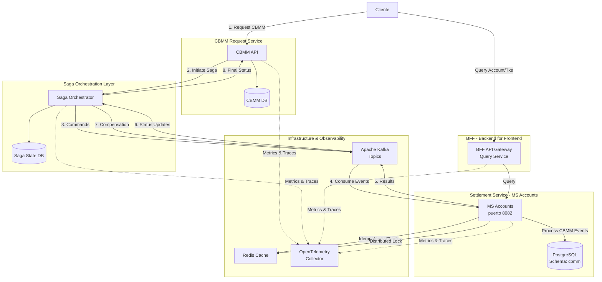
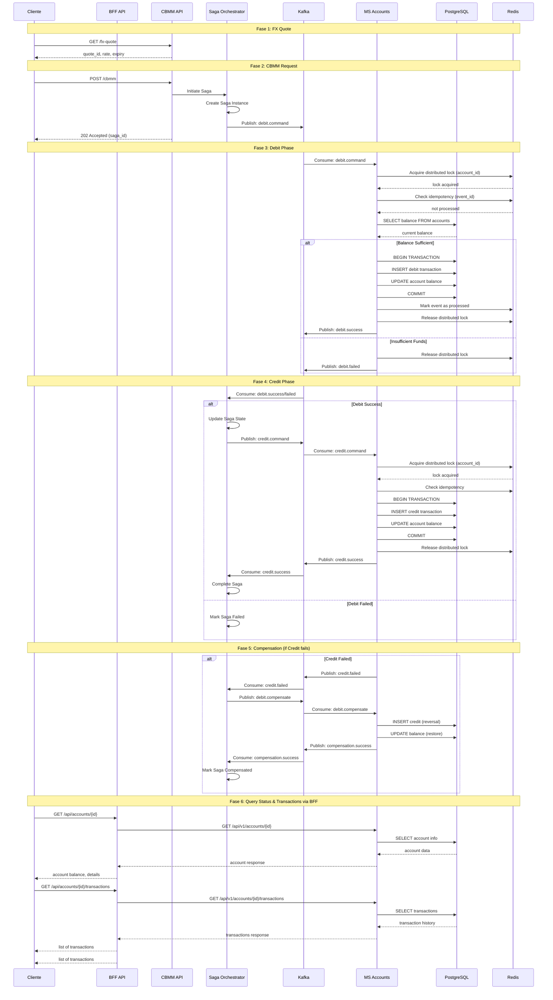

# Test Cobre - Docker Compose

Infraestructura completa para el proyecto CBMM (Cross Border Money Movement) de Cobre - una plataforma transaccional, cloud-native, event-driven basada en microservicios para gestión de movimientos de dinero transfronterizos entre diferentes monedas.

## 🎯 El Desafío CBMM

Sistema asíncrono para movimientos de dinero entre monedas (USD, COP, MXN, etc.) con las siguientes características:

- **Idempotencia**: Operaciones repetidas no generan inconsistencias
- **Consistencia Eventual**: Sistema distribuido con garantías de consistencia
- **Event-Driven**: Procesamiento asíncrono mediante eventos
- **Arquitectura Hexagonal**: Separación de responsabilidades y alta testabilidad

### Flujo del Proceso

1. **FX Quote**: Cliente obtiene cotización de cambio del CBMM Request Service
2. **CBMM Request**: Solicitud enviada al CBMM Request Service, que inicia una saga
3. **Orchestration**: Saga Orchestrator (componente transversal) coordina el flujo
4. **Settlement**: Settlement Service (MS Accounts) procesa eventos de débito/crédito desde Kafka
5. **Validation**: Settlement Service valida balance, ejecuta transacciones y actualiza cuentas
6. **Compensation**: Si falla, el Saga Orchestrator ejecuta reversiones automáticas
7. **Notification**: Saga Orchestrator notifica resultado final al CBMM Request Service
8. **Query**: Cliente consulta cuentas y transacciones a través del BFF (Backend for Frontend), que se comunica con Settlement Service

## 🏛️ Arquitectura del Sistema

### Diagrama de Arquitectura



### Diagrama de Secuencia - Flujo CBMM



### Principios de Diseño

**Patrón Saga Orchestrator**
- Coordinación centralizada del flujo transaccional distribuido
- Separación entre operaciones (debit/credit) con comandos independientes
- Gestión de estados de la saga: PENDING → DEBITED → COMPLETED/FAILED/COMPENSATED
- Compensación automática en caso de fallo (reversión de débito si el crédito falla)

**Idempotencia**
- Uso de `event_id` único para detectar eventos duplicados
- Cache distribuido (Redis) para tracking de eventos procesados
- Bloqueo distribuido (Redis) para prevenir race conditions en operaciones concurrentes
- Operaciones de base de datos con constraints únicos

**Bloqueo Distribuido (Distributed Locking)**
- Locks basados en Redis para operaciones críticas sobre cuentas
- Prevención de race conditions en procesamiento concurrente
- Adquisición de lock antes de validar balance y ejecutar transacciones
- Liberación automática de lock después de completar operación (éxito o fallo)
- Garantiza serialización de operaciones sobre la misma cuenta

**Consistencia Eventual**
- Transacciones distribuidas mediante Saga Pattern
- Eventos de compensación en caso de fallo parcial
- Estado final convergente mediante retry con backoff exponencial

**Resiliencia**
- Dead Letter Queue (DLQ) para eventos fallidos
- Circuit breaker en comunicaciones entre servicios
- Health checks en todos los componentes
- Timeout configurables por paso de la saga

## 🏦 MS Accounts - Settlement Service

El microservicio **MS Accounts** (Settlement Service) está implementado en Spring Boot con arquitectura hexagonal. Sus responsabilidades incluyen:

### Capacidades Principales

**1. Gestión de Cuentas**
- Consulta de información de cuenta por `account_id`
- Mantenimiento de balance actual de cada cuenta
- Soporte multi-moneda (USD, COP, MXN, etc.)

**2. Gestión de Transacciones**
- Registro de todas las transacciones (débitos y créditos)
- Ledger completo asociado a cada cuenta
- Consulta de historial de transacciones por cuenta

**3. Procesamiento de Eventos CBMM**
- Consumo de eventos desde Kafka
- Validación de balance antes de ejecutar débitos
- Ejecución de transacciones débito/crédito
- Publicación de resultados a Kafka

**4. Procesamiento por Lotes**
- Carga de archivos JSON con múltiples eventos CBMM
- Procesamiento concurrente de eventos
- Endpoint: `POST /api/v1/events/batch/upload`

**5. Idempotencia**
- Verificación de `event_id` único
- Cache en Redis para eventos ya procesados
- Bloqueo distribuido (Redis locks) para prevenir race conditions
- Prevención de procesamiento duplicado

### API REST Endpoints

**MS Accounts (Settlement Service):**
```
GET  /api/v1/accounts/{accountId}              - Obtener cuenta
GET  /api/v1/accounts/{accountId}/transactions - Listar transacciones
POST /api/v1/events/batch/upload               - Cargar eventos en batch
GET  /actuator/health                          - Health check
```

**BFF (Backend for Frontend):**
```
GET  /api/accounts/{accountId}                 - Consultar cuenta (proxy to MS Accounts)
GET  /api/accounts/{accountId}/transactions    - Consultar transacciones (proxy to MS Accounts)
GET  /api/accounts/{accountId}/history         - Historial completo (agregación)
GET  /health                                    - Health check
```

### Dependencias

- **PostgreSQL**: Persistencia de cuentas y transacciones (schema: `cbmm`)
- **Redis**: Cache para idempotencia y bloqueo distribuido (prevención de race conditions)

## 🏗️ Servicios Incluidos

Este stack incluye los siguientes servicios:

- **PostgreSQL 14**: Base de datos principal con schema `cbmm` pre-configurado
- **Redis 7**: Cache y almacenamiento de datos en memoria para idempotencia
- **Apache Kafka**: Message broker para eventos y mensajería asíncrona
- **Zookeeper**: Coordinación de servicios de Kafka
- **OpenTelemetry Collector**: Recolección de métricas y trazas
- **MS Accounts** (Settlement Service): Microservicio Spring Boot con arquitectura hexagonal para gestión de cuentas, transacciones y procesamiento de eventos CBMM
- **BFF (Backend for Frontend)**: API Gateway para consultas de clientes (cuentas, transacciones, historial)
- **Saga Orchestrator** (Diseño): Componente transversal para coordinación de transacciones distribuidas

### Estructura del MS Accounts (Arquitectura Hexagonal)

```
ms/accounts/
├── src/main/java/co/cobre/cbmm/accounts/
│   ├── adapters/
│   │   ├── in/                          # Adaptadores de entrada (Driving)
│   │   │   ├── rest/                    # REST Controllers
│   │   │   │   ├── AccountController.java
│   │   │   │   ├── TransactionController.java
│   │   │   │   └── BatchEventController.java
│   │   │   └── messaging/               # Kafka Consumers
│   │   │       └── KafkaEventConsumer.java
│   │   ├── out/                         # Adaptadores de salida (Driven)
│   │   │   ├── persistence/             # JPA Repositories
│   │   │   │   ├── AccountRepositoryAdapter.java
│   │   │   │   ├── TransactionRepositoryAdapter.java
│   │   │   │   ├── CBMMEventRepositoryAdapter.java
│   │   │   │   ├── entity/              # Entidades JPA
│   │   │   │   │   ├── AccountEntity.java
│   │   │   │   │   ├── TransactionEntity.java
│   │   │   │   │   └── CBMMEventEntity.java
│   │   │   │   └── repository/          # Spring Data JPA
│   │   │   │       ├── AccountJpaRepository.java
│   │   │   │       ├── TransactionJpaRepository.java
│   │   │   │       └── CBMMEventJpaRepository.java
│   │   │   └── cache/                   # Redis
│   │   │       └── RedisIdempotencyAdapter.java
│   │   └── config/                      # Configuraciones
│   ├── application/
│   │   ├── service/                     # Casos de uso
│   │   │   ├── ProcessCBMMEventUseCase.java
│   │   │   ├── AsyncAccountProcessingService.java
│   │   │   └── BatchEventProcessingService.java
│   │   └── dto/                         # Data Transfer Objects
│   │       ├── CBMMEventDTO.java
│   │       ├── AccountDTO.java
│   │       └── TransactionResponseDTO.java
│   ├── domain/
│   │   ├── model/                       # Entidades de dominio
│   │   │   ├── Account.java
│   │   │   ├── Transaction.java
│   │   │   ├── Currency.java            # Enum: USD, COP, MXN, EUR, etc.
│   │   │   ├── AccountStatus.java       # Enum: ACTIVE, INACTIVE, etc.
│   │   │   ├── TransactionType.java     # Enum: CREDIT, DEBIT
│   │   │   └── TransactionStatus.java   # Enum: PENDING, COMPLETED, FAILED
│   │   ├── service/                     # Servicios de dominio
│   │   │   └── DistributedLockService.java
│   │   └── exception/                   # Excepciones de dominio
│   │       ├── InsufficientBalanceException.java
│   │       ├── DuplicateEventException.java
│   │       ├── AccountNotFoundException.java
│   │       └── EventProcessingException.java
│   └── ports/
│       ├── in/                          # Puertos de entrada
│       │   ├── ProcessCBMMEventPort.java
│       │   ├── GetAccountPort.java
│       │   └── GetTransactionsPort.java
│       └── out/                         # Puertos de salida
│           ├── AccountRepositoryPort.java
│           ├── TransactionRepositoryPort.java
│           ├── CBMMEventRepositoryPort.java
│           └── IdempotencyPort.java
└── src/test/                            # Tests (unit, integration, functional)
```

### Características de Implementación

**Arquitectura Hexagonal (Ports & Adapters)**
- **Capa de Dominio**: Entidades (`Account`, `Transaction`), Value Objects (`Currency`, `AccountStatus`), excepciones de dominio
- **Puertos de Entrada**: Interfaces que definen casos de uso (`ProcessCBMMEventPort`, `GetAccountPort`)
- **Puertos de Salida**: Interfaces para persistencia y cache (`AccountRepositoryPort`, `IdempotencyPort`)
- **Adaptadores de Entrada**: REST Controllers, Kafka Consumers
- **Adaptadores de Salida**: JPA Repositories, Redis Cache

**Patrones Implementados**
- **Virtual Threads** (Java 21): Procesamiento asíncrono eficiente con `AsyncAccountProcessingService`
- **Optimistic Locking**: Control de concurrencia con `@Version` en entidades JPA
- **Distributed Locking**: Redis-based para operaciones críticas y prevención de race conditions
- **Idempotency**: Triple capa (API + Event + DB) con Redis cache
- **Event Sourcing**: Tracking completo de eventos CBMM
- **Retry Pattern**: `@Retryable` para `ObjectOptimisticLockingFailureException`

**Tecnologías**
- Spring Boot 3.x
- Java 21 (Virtual Threads)
- PostgreSQL 15 + Hibernate Envers (auditoría)
- Redis 7 (cache e idempotencia)
- Apache Kafka 3.x (event streaming)
- OpenTelemetry (observabilidad)

## 📋 Prerequisitos

- Docker y Docker Compose instalados y corriendo
- Verificar que los siguientes puertos estén disponibles:
  - **5432**: PostgreSQL
  - **6379**: Redis
  - **2181**: Zookeeper
  - **9092, 9093**: Kafka
  - **4317, 4318**: OpenTelemetry Collector (gRPC y HTTP)
  - **8082**: MS Accounts API
  - **8888**: OpenTelemetry Collector Health

## 🚀 Iniciar el Stack

Para levantar toda la infraestructura:

```sh
docker-compose up
```

Para ejecutar en segundo plano:

```sh
docker-compose up -d
```

## 🛑 Detener el Stack

```sh
docker-compose down
```

Para eliminar también los volúmenes:

```sh
docker-compose down -v
```

## 🔧 Configuración

### PostgreSQL
- **Base de datos**: `postgres`
- **Usuario**: `root`
- **Contraseña**: `root`
- **Schema**: `cbmm` (creado automáticamente)
- **Puerto**: `5432`

### Redis
- **Puerto**: `6379`
- **Modo**: Persistencia con appendonly activado

### Kafka
- **Puerto interno**: `9092`
- **Puerto externo**: `9093` (para conexiones desde localhost)
- **Topics**: Creación automática habilitada

### OpenTelemetry Collector
- **Puerto gRPC**: `4317`
- **Puerto HTTP**: `4318`
- **Prometheus metrics**: `9090`

## 📁 Archivos de Configuración

- `docker-compose.yml`: Definición de servicios
- `init-db.sql`: Script de inicialización de PostgreSQL
- `otel-collector-config.yaml`: Configuración del OpenTelemetry Collector
- `Test Cobre.postman_collection.json`: Colección de Postman para testing

## 🧪 Colección de Postman

El proyecto incluye una colección de Postman para facilitar el testing de la API.

📦 **Archivo**: [`Test Cobre.postman_collection.json`](./Test%20Cobre.postman_collection.json)

La colección contiene los siguientes endpoints para testing:

### Endpoints Disponibles

1. **GET Account**
   - URL: `GET http://localhost:8082/api/v1/accounts/ACC-2024-005`
   - Descripción: Obtiene información de una cuenta específica
   - Script de test: Guarda automáticamente el `account_id` en las variables de entorno

2. **GET Transactions by Account Number**
   - URL: `GET http://localhost:8082/api/v1/accounts/{{account_id}}/transactions`
   - Descripción: Obtiene todas las transacciones de una cuenta
   - Utiliza la variable `{{account_id}}` del request anterior

3. **POST Batch**
   - URL: `POST http://localhost:8082/api/v1/events/batch/upload`
   - Descripción: Carga un archivo JSON con eventos en batch
   - Content-Type: `multipart/form-data`
   - Parámetro: `file` (archivo JSON)

4. **Health**
   - URL: `GET http://localhost:8082/actuator/health`
   - Descripción: Verifica el estado de salud de la aplicación

### Importar la Colección

Para usar la colección en Postman:

1. Descarga o clona este repositorio
2. Abre Postman
3. Click en "Import" en la parte superior izquierda
4. Arrastra el archivo [`Test Cobre.postman_collection.json`](./Test%20Cobre.postman_collection.json) o selecciónalo manualmente
5. La colección "Test Cobre" aparecerá en tu workspace

**Nota**: Los endpoints asumen que el microservicio de cuentas está corriendo en `http://localhost:8082`. Asegúrate de tener la aplicación corriendo antes de ejecutar las pruebas.

## 📦 Formato de Eventos CBMM

Estructura de eventos para movimientos transfronterizos:

```json
{
  "event_id": "cbmm_20250909_000123",
  "event_type": "cross_border_money_movement",
  "operation_date": "2025-09-09T15:32:10Z",
  "origin": {
    "account_id": "ACC123456789",
    "currency": "COP",
    "amount": 15000.50
  },
  "destination": {
    "account_id": "ACC987654321",
    "currency": "USD",
    "amount": 880.25
  }
}
```

**Campos:**
- `event_id`: Identificador único para idempotencia
- `event_type`: Tipo de operación
- `operation_date`: Timestamp ISO 8601 (UTC)
- `origin/destination`: Cuenta, moneda y monto

## 🌐 Network

Todos los servicios están conectados a la red `cbmm-network` con IPs estáticas:
- PostgreSQL: `172.25.0.10`
- Redis: `172.25.0.11`
- Zookeeper: `172.25.0.12`
- Kafka: `172.25.0.13`
- OpenTelemetry: `172.25.0.14`
- MS Accounts: `172.25.0.15`

## 💾 Volúmenes

Los datos se persisten en los siguientes volúmenes:
- `postgres_data`: Datos de PostgreSQL
- `redis_data`: Datos de Redis

## 🔍 Health Checks

Todos los servicios incluyen health checks configurados para garantizar su disponibilidad antes de iniciar servicios dependientes.

